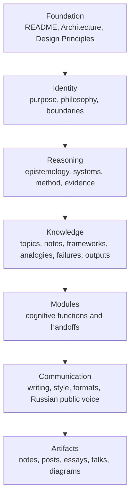
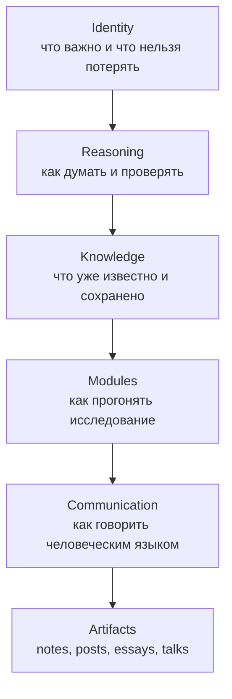
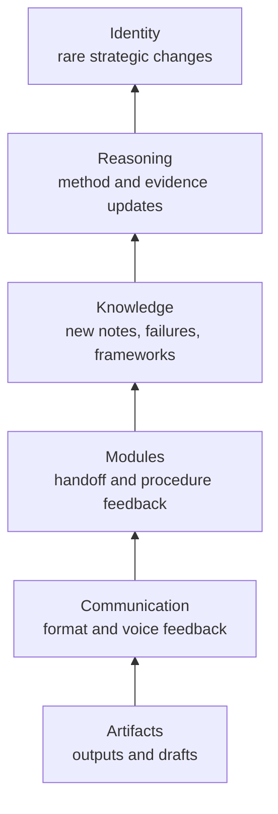
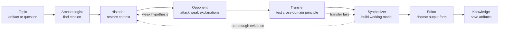
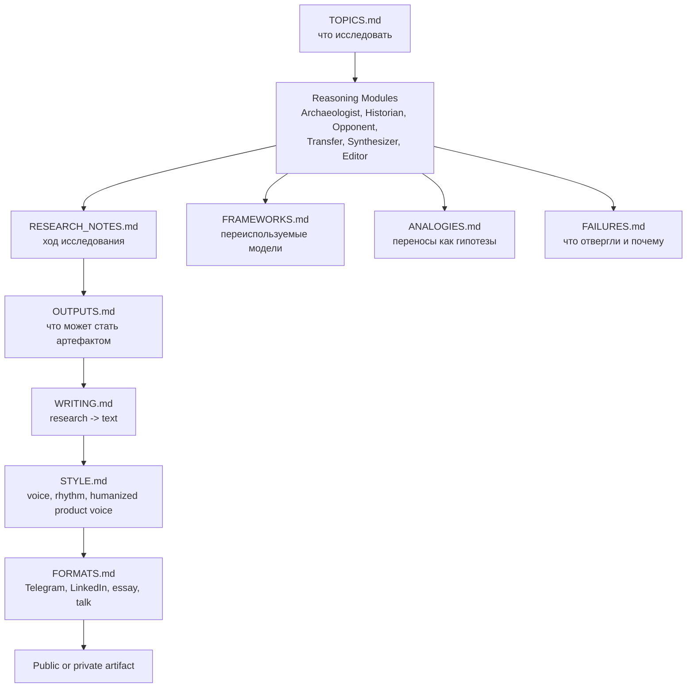

# Thinking Lab

> Исследовательская система для поиска простых идей за сложными технологиями,
> продуктами, организациями и процессами.

Thinking Lab — это не Telegram-канал, не LinkedIn-блог и не фабрика контента.

Это личная исследовательская система: способ регулярно превращать наблюдения
о технологиях, продуктах, командах, AI, безопасности и других сложных системах
в понятные объяснения, принципы и, если есть смысл, публичные тексты.

Публикации здесь являются результатом работы системы.
Цель системы — понимание.

---

## Что это

Thinking Lab начинается не с идеи “надо что-то запостить”, а с конкретного
артефакта или вопроса.

Артефактом может быть технология, продукт, протокол, организация, процесс,
ошибка, привычка, стандарт, управленческий паттерн или странный успех, который
почему-то пережил альтернативы.

Примеры:

- Git;
- SQL;
- TCP;
- Linux;
- Docker;
- Kubernetes;
- Excel;
- feature flags;
- roadmaps;
- security incidents;
- AI agents;
- командные ритуалы;
- продуктовые метрики.

Но настоящий предмет исследования — не сам артефакт.

Настоящий предмет — идея за ним: какая работа выполняется, какое трение
снижается, какое поведение становится дешевле, какие ограничения сформировали
решение и какой принцип можно перенести в другой домен.

Например, Git можно изучать не только как систему контроля версий. Его можно
рассматривать как продукт, который снизил цену безопасного эксперимента для
разработчиков и команд.

---

## Зачем это нужно

Проект появился из простого практического вопроса:

> Делать Telegram-канал, LinkedIn-канал или что-то ещё?

Но довольно быстро стало понятно, что начинать с платформы неправильно.

Платформа отвечает на вопрос “где публиковать”.
Thinking Lab отвечает на другой вопрос:

> Как создать условия, в которых хорошее мышление может повторяться?

Если сразу строить канал, система начинает оптимизироваться под частоту,
формат, реакцию аудитории и привычные контентные паттерны. Это легко превращает
даже неплохие идеи в поверхностные посты.

Thinking Lab устроен наоборот: сначала исследование, потом понимание, потом
решение, нужен ли вообще публичный output.

---

## Главная идея

Thinking Lab ищет идеи, которые переживают конкретные технологии.

Базовое движение системы:

```text
artifact -> question -> context -> explanation -> critique -> principle -> transfer -> output
```

Система задаёт вопросы:

- почему это вообще появилось;
- какую работу это выполняет для человека или команды;
- какие ограничения сформировали решение;
- какие альтернативы были рядом;
- почему простое объяснение недостаточно;
- что это сделало дешевле или дороже;
- какой принцип можно перенести в продукт, организацию, безопасность или AI;
- где этот перенос ломается.

Важно: не каждое исследование должно стать публикацией.

Хороший вопрос, отвергнутая гипотеза, сильный контраргумент или найденный
framework тоже являются ценным результатом.

---

## Исследовательские оптики

У Thinking Lab есть одна настоящая “рубрика”:

> исследование идей, которые стоят за успешными технологиями, организациями и
> сложными системами.

Остальное — не рубрики и не контентные направления. Это разные оптики, через
которые можно исследовать одну и ту же вещь.

### 1. Археология инженерных решений

Главный формат исследования.

Вопрос:

> Почему именно эта идея пережила остальные?

Примеры:

- почему Git победил;
- почему SQL жив уже 50 лет;
- почему TCP до сих пор основа Интернета;
- почему Linux оказался настолько успешным.

### 2. Инженерия управления

Перенос инженерного мышления в управление командами, организациями и
продуктами.

Примеры:

- почему хорошие процессы деградируют;
- почему KPI начинают врать;
- почему планы не работают;
- почему Conway's Law снова и снова оказывается полезной.

### 3. Аналогии между разными мирами

Поиск одного и того же принципа в системах, которые внешне не похожи друг на
друга.

Примеры:

- Git и организационная культура;
- AppSec и управление компанией;
- incident response и кризисное управление;
- архитектура ПО и устройство города.

Аналогии здесь не считаются доказательствами. Они являются гипотезами, которые
нужно проверять структурно.

### 4. Модели мышления

Не “что делать”, а “как думать”.

Примеры:

- цена эксперимента;
- ограничения важнее возможностей;
- почему люди путают симптом и проблему;
- почему локальная оптимизация ломает систему.

### 5. Будущее инженерии

Не новости про AI, а фундаментальные изменения в инженерном труде,
организациях и продуктах.

Примеры:

- что изменится, когда агент сможет работать неделю без человека;
- что останется ценным, если код станет дешёвым;
- как AI меняет организацию труда.

### 6. Незавершённые исследования

Формат для честного показа мысли в процессе.

Это не статья и не готовый вывод. Это может начинаться с ощущения:

> Я уже неделю думаю вот об этом...

Ценность такого формата в том, что он показывает не только вывод, но и путь:
сомнения, промежуточные гипотезы, слабые места, повороты и незакрытые вопросы.

### 7. Разбор ошибок

Ошибки часто объясняют мир лучше успехов.

Примеры:

- почему идея провалилась;
- почему продукт умер;
- почему архитектура не взлетела;
- почему процесс выглядел разумно, но начал ломать систему.

### 8. Выделение фундаментального принципа

Это не отдельная рубрика, а финальная цель почти любого исследования.

В конце важно спросить:

> Какой принцип мы нашли?

Примеры:

- Git -> цена эксперимента;
- Docker -> изоляция как снижение сложности;
- TCP -> надёжность через простые правила;
- feature flags -> обратимость изменений.

Одна тема может проходить через несколько оптик сразу. Например, Git можно
исследовать как археологию инженерного решения, как аналогию для организации,
как модель мышления про цену эксперимента и как источник продуктового
принципа.

---

## Архитектура

Thinking Lab состоит из нескольких слоёв. Верхние слои стабильнее и задают
ограничения. Нижние слои гибче и чаще меняются от практики.



Подробная архитектура описана в [ARCHITECTURE.md](ARCHITECTURE.md).
Правила развития системы описаны в [DESIGN_PRINCIPLES.md](DESIGN_PRINCIPLES.md).

---

## Как работают слои

### Foundation

Foundation — это вход и каркас проекта.

Сюда входят:

- [README.md](README.md) — русская входная точка в проект;
- [ARCHITECTURE.md](ARCHITECTURE.md) — архитектура системы;
- [DESIGN_PRINCIPLES.md](DESIGN_PRINCIPLES.md) — принципы проектирования.

Этот слой отвечает на вопрос: что мы вообще строим и как система должна
развиваться, чтобы не расползтись в набор случайных заметок.

### Identity

Identity задаёт смысл проекта и его границы.

Главный документ:

- [identity/PHILOSOPHY.md](identity/PHILOSOPHY.md)

Этот слой защищает Thinking Lab от дрейфа. Он фиксирует, что проект не является
продуктовым блогом, cybersecurity-каналом, LinkedIn-машиной или коллекцией
AI-промптов. Домены могут меняться, но центральная задача остаётся прежней:
искать переносимые идеи за сложными системами.

### Reasoning

Reasoning определяет, как Thinking Lab думает.

Документы:

- [reasoning/EPISTEMOLOGY.md](reasoning/EPISTEMOLOGY.md)
- [reasoning/SYSTEMS.md](reasoning/SYSTEMS.md)
- [reasoning/RESEARCH_METHOD.md](reasoning/RESEARCH_METHOD.md)
- [reasoning/EVIDENCE.md](reasoning/EVIDENCE.md)

Этот слой отвечает за качество мышления: что считать знанием, как работать с
неопределённостью, как проверять объяснения, как отличать сильную аналогию от
красивой, но слабой истории.

Если коротко: Reasoning не даёт системе писать уверенно о том, что она ещё не
поняла.

### Knowledge

Knowledge — это память Thinking Lab.

Документы:

- [knowledge/KNOWLEDGE_BASE.md](knowledge/KNOWLEDGE_BASE.md)
- [knowledge/TOPICS.md](knowledge/TOPICS.md)
- [knowledge/RESEARCH_NOTES.md](knowledge/RESEARCH_NOTES.md)
- [knowledge/FRAMEWORKS.md](knowledge/FRAMEWORKS.md)
- [knowledge/ANALOGIES.md](knowledge/ANALOGIES.md)
- [knowledge/FAILURES.md](knowledge/FAILURES.md)
- [knowledge/OUTPUTS.md](knowledge/OUTPUTS.md)

Этот слой хранит не “контент”, а исследовательскую память: темы, рабочие
заметки, frameworks, аналогии, слабые объяснения, failed hypotheses и будущие
outputs.

Его задача — сделать так, чтобы каждое новое исследование не начиналось с нуля.

### Modules

Modules — это рабочие когнитивные функции.

Документы:

- [modules/MODULES.md](modules/MODULES.md)
- [modules/archaeologist.md](modules/archaeologist.md)
- [modules/historian.md](modules/historian.md)
- [modules/opponent.md](modules/opponent.md)
- [modules/transfer.md](modules/transfer.md)
- [modules/synthesizer.md](modules/synthesizer.md)
- [modules/editor.md](modules/editor.md)

Модули — не персонажи и не AI-агенты. Это responsibilities, которые может
выполнять человек, AI-модель, чеклист или будущий инструмент.

Базовый pipeline:

```text
Archaeologist -> Historian -> Opponent -> Transfer -> Synthesizer -> Editor
```

Если гипотеза слабая, pipeline может возвращаться назад: к источникам,
контексту, критике или формулировке вопроса.

### Communication

Communication отвечает за превращение понимания в человеческий текст.

Документы:

- [communication/WRITING.md](communication/WRITING.md)
- [communication/STYLE.md](communication/STYLE.md)
- [communication/HUMANIZER_RULES.md](communication/HUMANIZER_RULES.md)
- [communication/FORMATS.md](communication/FORMATS.md)

Этот слой не должен заставлять систему публиковать больше. Он нужен для того,
чтобы не потерять мысль при переводе исследования в Telegram, LinkedIn, essay,
talk или внутреннюю заметку.

Публичные outputs по умолчанию пишутся на русском.

Голос по умолчанию: умный разговорный русский, без академического тумана,
LinkedIn-пафоса и generic AI-ритма. После первого практического прогона в
[communication/STYLE.md](communication/STYLE.md) зафиксирован humanized product
voice: писать как продуктовый инженер или руководитель продукта, держать в
фокусе JTBD, работу пользователя, трение, цену действия и изменение поведения
команды.

### Humanizer

Humanizer — это отдельный reusable layer для живого русского текста.

Он лежит в [humanizer/](humanizer/) и может применяться вне Thinking Lab: к
главам книги, деловым текстам, эссе, постам или обычным черновикам.

Thinking Lab использует Humanizer как зависимость, но не равен ему. Universal
rules живут в [humanizer/HUMANIZER_CORE.md](humanizer/HUMANIZER_CORE.md), а
Thinking Lab-specific правила остаются в `communication/`: research-first
логика, product/JTBD voice, output formats и anti-LinkedIn theater.

Для использования вне Thinking Lab есть self-contained skill
[skills/russian-humanizer](skills/russian-humanizer/). Его можно целиком
скопировать в `%USERPROFILE%\.codex\skills\russian-humanizer`, и он будет
работать без этого репозитория.

Отдельно vendored skill
[skills/humanize-ru](skills/humanize-ru/) снимает AI-маркеры с сохранением
регистра (диагностика → трансформация → checklist). В пайплайне драфтов он
идёт после anti-patterns и до `HUMANIZER_CORE`. Не заменяет
`russian-humanizer`: modes и voice adapters остаются в portable humanizer.

---

## Поток знаний

В Thinking Lab знания текут вниз.

Верхние слои задают ограничения для нижних. Например, философия ограничивает
метод исследования, evidence rules ограничивают выводы, а style guide
ограничивает то, как исследование превращается в текст.



Нижние слои не должны тихо переопределять верхние. Если одно и то же правило
начинает повторяться в разных местах, скорее всего, оно должно подняться выше.

---

## Поток обратной связи

Обратная связь течёт вверх.

Плохой draft может показать проблему в стиле. Слабая публикация может показать
дырку в reasoning. Повторяющаяся failed hypothesis может изменить research
method. Редко, но возможно, практический опыт может изменить даже philosophy.



Чем выше слой, тем осторожнее он должен меняться.

---

## Как проходит исследование

Стандартный ручной pipeline выглядит так:



Модули не обязаны выполняться автоматически. Сейчас v0.1 устроен как ручная
оркестрация: человек или AI проходит по шагам, фиксирует результаты и решает,
что делать дальше.

---

## Ручная оркестрация

Чтобы запустить исследование вручную:

1. Выбрать тему или артефакт.
2. Добавить тему в [knowledge/TOPICS.md](knowledge/TOPICS.md).
3. Сформулировать вопрос и tension через `Archaeologist`.
4. Восстановить исторический и системный контекст через `Historian`.
5. Атаковать слабые объяснения через `Opponent`.
6. Проверить перенос принципа через `Transfer`.
7. Собрать рабочую модель через `Synthesizer`.
8. Принять output decision через `Editor`.
9. Сохранить ход исследования в [knowledge/RESEARCH_NOTES.md](knowledge/RESEARCH_NOTES.md).
10. Разнести найденные frameworks, analogies, failures и outputs по knowledge-файлам.
11. Только после этого писать draft, если он действительно нужен.

Главная роль ручного оркестратора — не “получить текст”, а не дать системе
перепрыгнуть через понимание.

---

## Как создать контент через диалог

Thinking Lab должен уметь работать нативно из обычного диалога.

Например, можно сказать:

> Сделай Telegram-пост про почему SQL жив 50 лет.

или:

> Хочу LinkedIn-пост про KPI, но через инженерное управление.

В таком запросе система должна различить несколько вещей:

- тему или артефакт;
- исследовательскую оптику;
- желаемый output type;
- аудиторию;
- глубину;
- зрелость исследования.

Это описано в [orchestration/CONTENT_FLOW.md](orchestration/CONTENT_FLOW.md).

Базовые output types v0.1:

- `telegram_note`;
- `linkedin_post`;
- `essay`;
- `working_note`;
- `unfinished_research`;
- `failure_analysis`.

Важно: выбранный формат не отменяет исследование.

Если пользователь просит Telegram-пост, но тема ещё слабая, система не должна
делать уверенный пост из воздуха. Она может предложить короткий research pass,
working note или unfinished research.

Для этого в репозитории есть project-local skill:

- [skills/thinking-lab-content/SKILL.md](skills/thinking-lab-content/SKILL.md)

Он нужен не для того, чтобы “быстро писать посты”, а чтобы запускать правильный
маршрут:

```text
dialogue -> intake -> research routing -> output decision -> draft or outline
```

---

## Связь Knowledge, Modules и Communication

Knowledge хранит память, Modules выполняют исследовательские функции,
Communication превращает результат в человеческий output.



Это важно: draft не должен появляться из воздуха. Он должен быть связан с
исследованием, заметками и output decision.

---

## Где что лежит

```text
README.md
ARCHITECTURE.md
DESIGN_PRINCIPLES.md

identity/
  PHILOSOPHY.md

reasoning/
  EPISTEMOLOGY.md
  SYSTEMS.md
  RESEARCH_METHOD.md
  EVIDENCE.md

knowledge/
  KNOWLEDGE_BASE.md
  TOPICS.md
  RESEARCH_NOTES.md
  FRAMEWORKS.md
  ANALOGIES.md
  FAILURES.md
  OUTPUTS.md

communication/
  WRITING.md
  STYLE.md
  HUMANIZER_RULES.md
  FORMATS.md

humanizer/
  README.md
  HUMANIZER_CORE.md
  MODES.md
  VOICE_ADAPTERS.md

orchestration/
  CONTENT_FLOW.md

modules/
  MODULES.md
  archaeologist.md
  historian.md
  opponent.md
  transfer.md
  synthesizer.md
  editor.md

skills/
  humanize-ru/
    SKILL.md
    LICENSE
    SOURCE.md
    references/
      ai-markers.md
      transformations.md
      checklist.md
  russian-humanizer/
    SKILL.md
    agents/openai.yaml
    references/
      HUMANIZER_CORE.md
      MODES.md
      VOICE_ADAPTERS.md
  thinking-lab-content/
    SKILL.md

outputs/
  draft and output artifacts

context/
  Thinking_Lab_Discussion_Summary.md
  Thinking_Lab_Design_Log.md
```

`context/` хранит исходный контекст проектирования: краткое резюме и design log
с историей решений, разворотов и отвергнутых альтернатив.

---

## Как из исследования появляется текст

Текст появляется только после output decision.

Сначала система должна понять:

- какой вопрос она исследует;
- какое объяснение предлагает;
- какие слабые объяснения отвергла;
- какой механизм считает главным;
- где границы уверенности;
- какой принцип можно перенести;
- какой формат лучше всего сохранит мысль.

После этого Communication layer помогает выбрать форму:

- Telegram — короткая исследовательская заметка с одной сильной мыслью;
- LinkedIn — профессиональный пост без thought-leadership театра;
- Essay — более длинное исследование с контекстом, evidence и limits;
- Talk/note — рабочий формат для обсуждения или будущего выступления.

Русский язык — default для публичных outputs.

Стиль должен звучать как живой человек, который понимает продуктовую,
инженерную и организационную реальность. Важна не “красивость” текста, а
ощущение, что автор думает вместе с читателем и не прячет слабую мысль за
полировкой.

---

## Пример: почему Git победил

Первый smoke test системы был проведён на теме:

> Почему Git победил?

Рабочая модель получилась такой:

Git победил не только потому, что был быстрым, распределённым, написан Линусом
или усилен GitHub. Эти факторы важны, но они не объясняют всю историю.

Более интересная гипотеза: Git хорошо попал в реальную работу разработчика и
команды. Он снизил цену безопасного эксперимента: стало проще пробовать,
ветвиться, сохранять промежуточные состояния, ошибаться, возвращаться назад и
работать параллельно.

Продуктовый перенос:

> Поведение команды меняется через стоимость действий.

Если учиться дорого, команда спорит, защищается и откладывает решения. Если
учиться относительно безопасно, появляется больше движения и меньше страха
перед ошибкой.

Результаты этого прогона сохранены в knowledge layer:

- тема в [knowledge/TOPICS.md](knowledge/TOPICS.md);
- research note в [knowledge/RESEARCH_NOTES.md](knowledge/RESEARCH_NOTES.md);
- framework `Cost of Reversible Experimentation` в [knowledge/FRAMEWORKS.md](knowledge/FRAMEWORKS.md);
- аналогии в [knowledge/ANALOGIES.md](knowledge/ANALOGIES.md);
- слабое объяснение “because GitHub” в [knowledge/FAILURES.md](knowledge/FAILURES.md);
- output candidates в [knowledge/OUTPUTS.md](knowledge/OUTPUTS.md).

---

## Текущий статус

Репозиторий инициализирован и опубликован на GitHub:

- [github.com/SergeyNash/thinking-lab](https://github.com/SergeyNash/thinking-lab)

Созданы базовые слои v0.1:

- foundation;
- identity;
- reasoning;
- knowledge;
- modules;
- communication.

Первый ручной smoke test на теме “Почему Git победил?” успешно проведён.

Humanized product voice и JTBD-оптика зафиксированы в
[communication/STYLE.md](communication/STYLE.md).

Dialog-first content flow зафиксирован в
[orchestration/CONTENT_FLOW.md](orchestration/CONTENT_FLOW.md), а project-local
skill для запуска этого флоу находится в
[skills/thinking-lab-content/SKILL.md](skills/thinking-lab-content/SKILL.md).

Проект сейчас находится в фазе раннего практического использования: архитектура
уже есть, но она должна проверяться на реальных исследованиях, а не только на
документах.

---

## Как продолжать работу

Хороший следующий шаг — брать реальные темы и прогонять их через систему.

Подходящий формат работы:

1. Выбрать одну тему.
2. Провести ручной module pipeline.
3. Зафиксировать результаты в knowledge layer.
4. Решить, нужен ли output.
5. Если нужен, выбрать формат в communication layer.
6. Написать draft.
7. После проверки обновить стиль, modules или knowledge, если процесс показал
   слабое место системы.

Автоматизацию стоит добавлять позже, когда ручной процесс станет достаточно
понятным. Сейчас важнее не ускорять систему, а убедиться, что она правильно
думает.

---

## Главное правило

Перед добавлением нового текста, слоя, модуля или output нужно спросить:

> Это улучшает понимание?

Если нет, скорее всего, это пока не нужно Thinking Lab.
